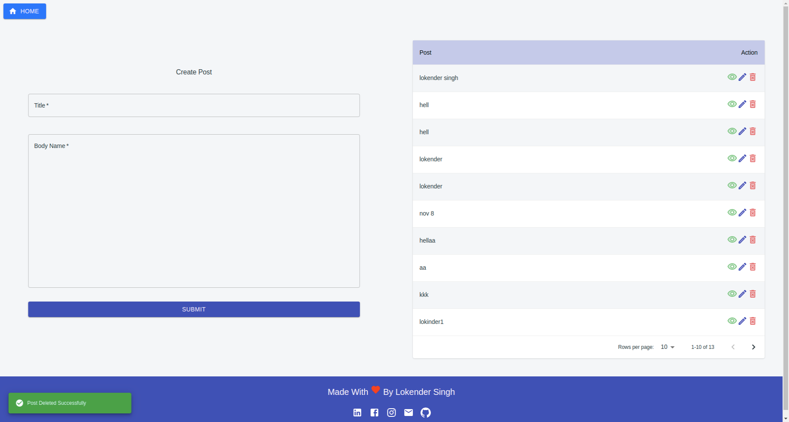
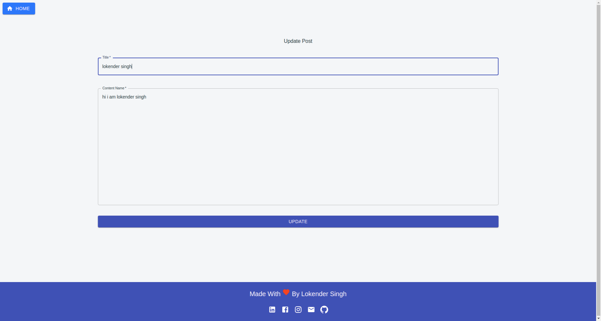
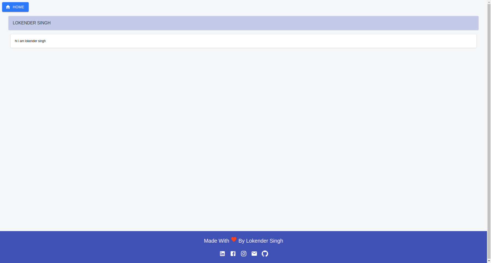

# Simple_Mern_Curd_Blog_Redux
It's a simple example or demo project of blog that do basic curd operation and maintain local state by redux
it's made by using following frontend technologies
- ReactJS
- Redux
- NodeJS
- MongoDB
- ExpressJS
- MaterialUI

## How To Run 
```
- Server
    1. Move To Server Directory
    cd server/

    2. Install Packages
    yarn

    3. start Server App
    nodemon server.js 

- Client    

    1. Move To Client Directory
    cd client/

    2. Install Packages
    yarn

    3. start Server App
    yarn start
```

## Demo ScreenShots

- Home


- Update


- View
